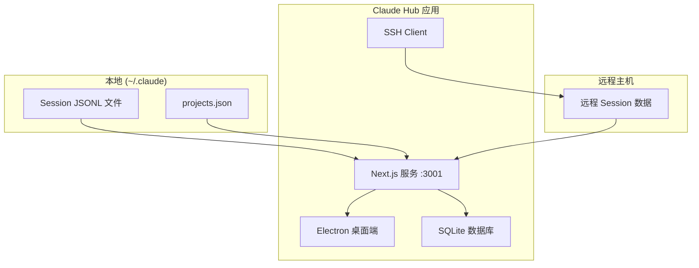
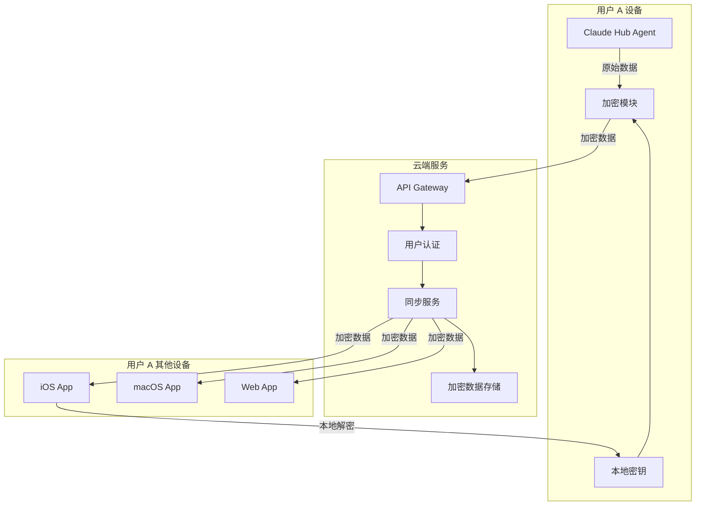

# Claude Hub 商业化规划

基于代码库分析，本文档规划如何将 Claude Hub 从个人工具转变为可商业化的多用户产品。

## 项目现状分析

### 当前架构



### 核心模块

| 模块 | 文件 | 功能 |
|------|------|------|
| Session 解析 | [claude-sessions.ts](file:///Users/hui/claudeProjects/claude-hub/src/lib/claude-sessions.ts) | 解析 JSONL 格式的 session 文件 |
| 数据库服务 | [database.ts](file:///Users/hui/claudeProjects/claude-hub/src/lib/database.ts) | SQLite 数据库，存储 sessions/tags/webhooks |
| 同步服务 | [db-sync.ts](file:///Users/hui/claudeProjects/claude-hub/src/lib/db-sync.ts) | 从 ~/.claude 同步到本地 DB |
| SSH 客户端 | [ssh-client.ts](file:///Users/hui/claudeProjects/claude-hub/src/lib/ssh-client.ts) | 支持远程主机 session 访问 |
| Mobile API | [mobile/sessions/route.ts](file:///Users/hui/claudeProjects/claude-hub/src/app/api/mobile/sessions/route.ts) | 为移动端提供 API |
| Electron 主进程 | [electron/main.js](file:///Users/hui/claudeProjects/claude-hub/electron/main.js) | 桌面端入口，启动 Next.js 服务 |

---

## 商业化路线图

### Phase 1: 完善现有产品（1-2 周）

> [!NOTE]
> 先把当前单用户版本做到极致，为后续商业化打好基础。

#### 目标
- [ ] 完成 iOS App 开发并通过 TestFlight 测试
- [ ] 完成 macOS App 打包并测试签名
- [ ] 优化 UI/UX，确保产品体验一流

#### 技术任务
- 使用你的 Apple Developer 账号签名 macOS App
- iOS App 使用 Expo 构建，通过 Xcode 安装到设备
- 确保 Mobile API 稳定可用

---

### Phase 2: 发布与验证（2-4 周）

#### 目标
- 在社交媒体发布产品，收集早期用户反馈
- 验证市场需求

#### 营销渠道
1. **Twitter/X** - Claude Code 用户活跃
2. **Reddit** - r/ClaudeAI, r/MacApps
3. **Hacker News** - Show HN
4. **Product Hunt** - 正式发布

#### 定价策略（初期）
- **免费发布**，收集用户反馈
- 或者 **$9.99 一次性买断**（iOS + macOS 套装）

---

### Phase 3: 多用户架构（4-8 周）

> [!IMPORTANT]
> 这是商业化的核心阶段，需要构建端到端加密的云同步服务。

#### 架构设计



#### 关键组件

| 组件 | 技术选型 | 说明 |
|------|----------|------|
| **后端服务** | Node.js + Hono/Express | 轻量级 API 服务 |
| **数据库** | PostgreSQL / Supabase | 存储加密后的 session 数据 |
| **认证** | Clerk / Auth0 / NextAuth | 用户认证与管理 |
| **加密** | libsodium / Web Crypto API | 端到端加密实现 |
| **存储** | S3 / Cloudflare R2 | 加密文件存储 |
| **部署** | Vercel / Railway / Fly.io | 服务部署 |

#### 端到端加密实现

```typescript
// 客户端加密伪代码
import { box, randomBytes } from 'tweetnacl';
import { encodeBase64 } from 'tweetnacl-util';

interface EncryptedSession {
  encryptedData: string;  // 加密后的 session 数据
  nonce: string;          // 随机数
  version: number;        // 加密版本
}

// 用户注册时生成密钥对
function generateUserKeys(password: string): KeyPair {
  const salt = randomBytes(16);
  const secretKey = deriveKey(password, salt);  // 从密码派生
  const publicKey = box.keyPair.fromSecretKey(secretKey).publicKey;
  return { publicKey, secretKey, salt };
}

// 加密 session 数据
function encryptSession(session: Session, userKey: Uint8Array): EncryptedSession {
  const nonce = randomBytes(24);
  const sessionBytes = new TextEncoder().encode(JSON.stringify(session));
  const encrypted = box(sessionBytes, nonce, userKey);
  return {
    encryptedData: encodeBase64(encrypted),
    nonce: encodeBase64(nonce),
    version: 1
  };
}

// 解密 session 数据
function decryptSession(encrypted: EncryptedSession, userKey: Uint8Array): Session {
  const decrypted = box.open(
    decodeBase64(encrypted.encryptedData),
    decodeBase64(encrypted.nonce),
    userKey
  );
  return JSON.parse(new TextDecoder().decode(decrypted));
}
```

> [!CAUTION]
> 密钥管理是核心安全问题：
> - 用户密钥**只存在用户设备上**，服务端永远不接触
> - 用户忘记密码 = 数据丢失（这是 E2EE 的代价）
> - 可以考虑支持"恢复短语"机制

---

### Phase 4: 上线订阅服务（8-12 周）

#### 定价方案

| 层级 | 月费 | 年费 | 功能 |
|------|------|------|------|
| **Free** | $0 | $0 | 本地使用，无云同步 |
| **Pro** | $4.99 | $39.99 | 云同步，3 台设备 |
| **Team** | $9.99/人 | $79.99/人 | 10 设备，团队共享（可选） |

#### 支付集成
- **iOS/macOS**: Apple In-App Purchase
- **Web**: Stripe / Paddle / LemonSqueezy

---

## 技术实施细节

### 新增文件结构

```
claude-hub/
├── packages/
│   ├── core/              # 共享核心逻辑
│   │   ├── crypto/        # 加密模块
│   │   ├── session/       # Session 解析
│   │   └── sync/          # 同步逻辑
│   ├── agent/             # 本地 Agent（上传数据）
│   ├── desktop/           # Electron + Next.js
│   ├── mobile/            # Expo / React Native
│   └── backend/           # 云端 API
├── apps/
│   └── web/               # Web 客户端（可选）
```

### 数据库 Schema（云端）

```sql
-- 用户表
CREATE TABLE users (
  id UUID PRIMARY KEY,
  email TEXT UNIQUE NOT NULL,
  public_key TEXT NOT NULL,  -- 用于验证签名
  created_at TIMESTAMP DEFAULT NOW()
);

-- 加密 Session 表
CREATE TABLE encrypted_sessions (
  id UUID PRIMARY KEY,
  user_id UUID REFERENCES users(id),
  session_id TEXT NOT NULL,
  encrypted_data TEXT NOT NULL,
  nonce TEXT NOT NULL,
  encryption_version INT DEFAULT 1,
  updated_at TIMESTAMP DEFAULT NOW(),
  UNIQUE(user_id, session_id)
);

-- 同步状态表
CREATE TABLE sync_status (
  user_id UUID REFERENCES users(id),
  device_id TEXT NOT NULL,
  last_sync TIMESTAMP,
  PRIMARY KEY(user_id, device_id)
);
```

### API 端点设计

| 端点 | 方法 | 说明 |
|------|------|------|
| `/api/auth/register` | POST | 用户注册，保存 public_key |
| `/api/auth/login` | POST | 用户登录 |
| `/api/sessions` | GET | 获取加密的 session 列表 |
| `/api/sessions` | POST | 上传加密的 session |
| `/api/sessions/:id` | GET | 获取单个加密 session |
| `/api/sessions/:id` | PUT | 更新加密 session |
| `/api/sync/status` | GET | 获取同步状态 |
| `/api/subscription` | GET | 获取订阅状态 |

---

## 安全考虑

### Zero-Knowledge 架构

```
┌─────────────────────────────────────────────────────────────┐
│                    你的服务器能看到的                         │
├─────────────────────────────────────────────────────────────┤
│ ✅ 用户 ID                                                   │
│ ✅ 加密后的数据（乱码）                                       │
│ ✅ 同步时间戳                                                 │
│ ✅ 数据大小                                                   │
├─────────────────────────────────────────────────────────────┤
│                    你的服务器看不到的                         │
├─────────────────────────────────────────────────────────────┤
│ ❌ Session 内容                                              │
│ ❌ 用户代码                                                   │
│ ❌ 对话历史                                                   │
│ ❌ 文件路径                                                   │
│ ❌ 任何明文信息                                               │
└─────────────────────────────────────────────────────────────┘
```

### 营销卖点

> "**Zero-knowledge encryption** - 您的代码和对话只有您自己能看到。  
> 即使我们的服务器被攻破，您的数据也是安全的。"

---

## 验证计划

### 自动化测试

目前项目没有发现现有的测试文件。建议在商业化过程中逐步添加：

1. **单元测试** - 加密/解密模块
2. **集成测试** - API 端点
3. **E2E 测试** - 完整的同步流程

### 手动验证

#### Phase 1 验证
1. 在 Mac 上打包应用，确认签名正确
2. 通过 Xcode 安装 iOS App 到真机
3. 验证 Mobile API 正常工作

#### Phase 3 验证
1. 创建测试用户，验证加密/解密流程
2. 在多设备间测试同步功能
3. 验证服务端确实只存储加密数据

---

## 下一步行动

> [!TIP]
> 建议按照以下优先级执行：

1. **立即**：完成 iOS App 构建和测试
2. **本周**：准备产品发布材料（截图、描述）
3. **两周内**：发布到社交媒体，收集反馈
4. **一个月内**：开始设计 E2EE 云同步架构
5. **两个月内**：上线 Pro 订阅功能

---

## 成本估算

| 项目 | 费用 | 说明 |
|------|------|------|
| Apple Developer | $99/年 | 已有 ✅ |
| 域名 | $12/年 | 品牌域名 |
| Vercel Pro | $20/月 | 后端部署 |
| Supabase Pro | $25/月 | 数据库 |
| Cloudflare R2 | ~$5/月 | 文件存储（按用量） |
| **总计（启动）** | **~$50/月** | |

预计需要 **~50 个付费用户**（$4.99/月）即可覆盖运营成本。
